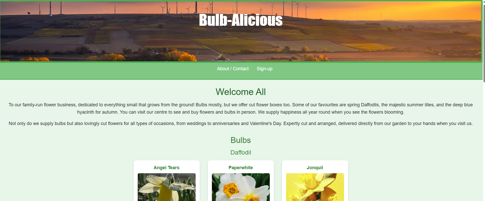
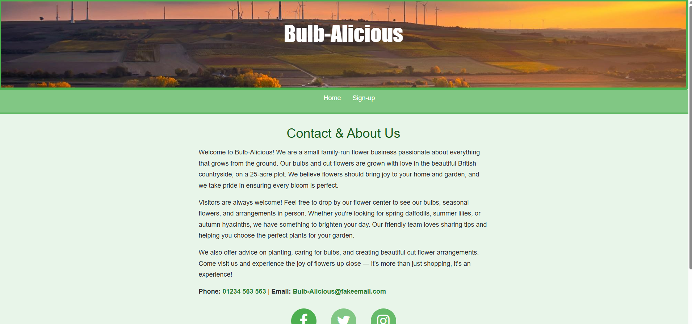
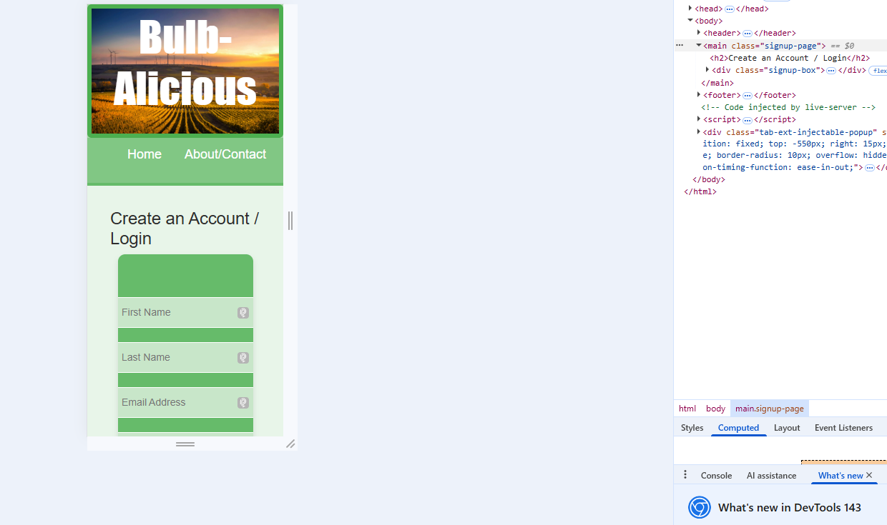
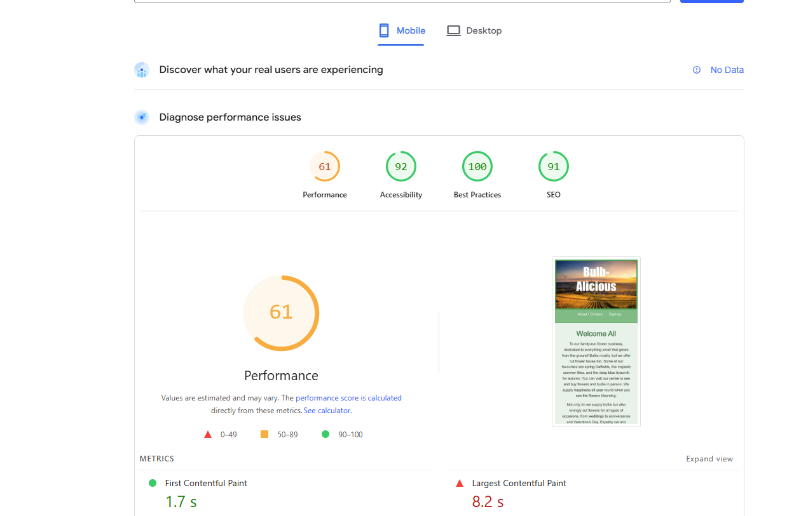
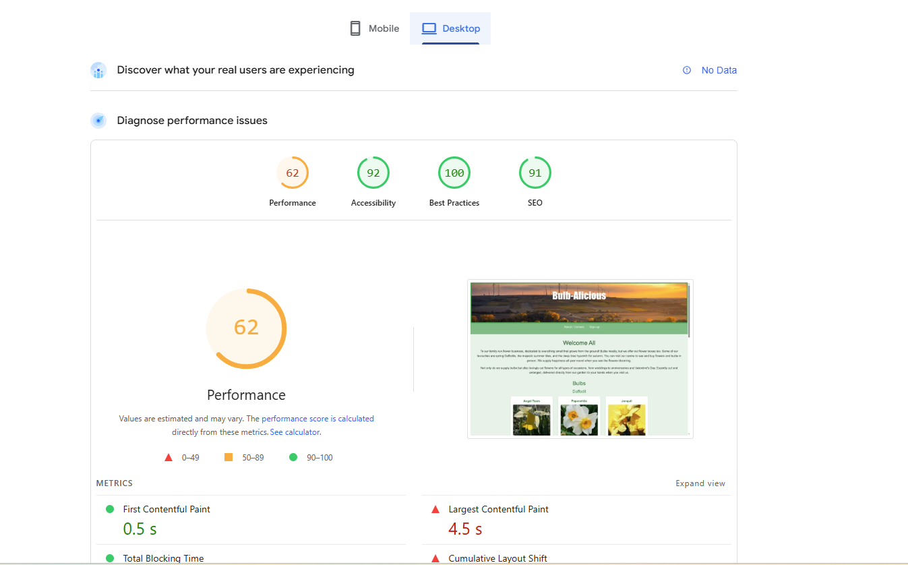
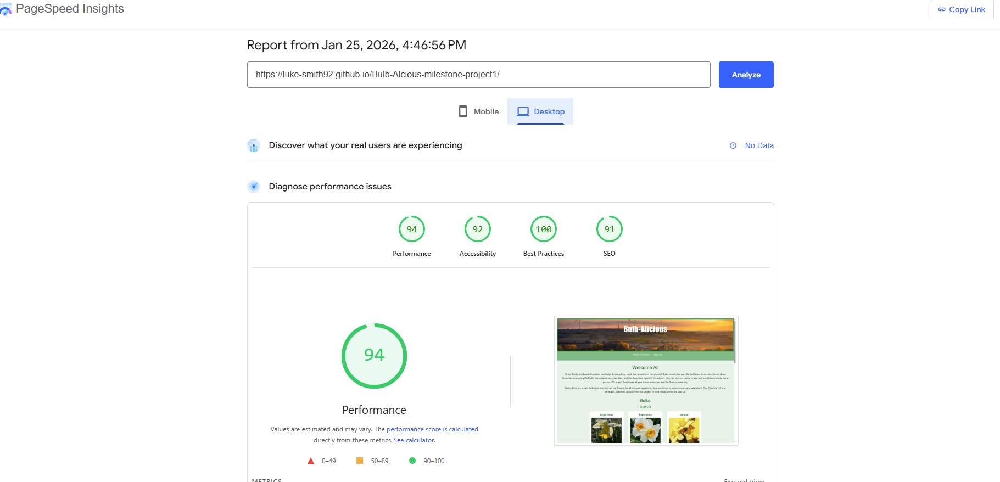
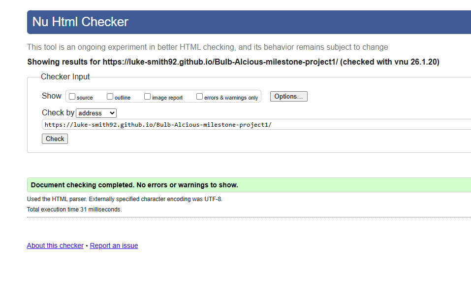
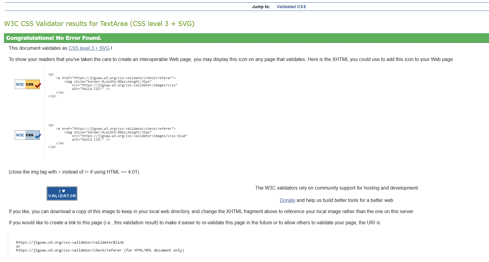

# Bulb-Alicious Project

## Project Overview

Bulb-Alicious is a front-end website designed for individuals who have a passion for gardening, particularly those interested in growing flowers at home. The site is aimed at gardening enthusiasts, beginners with limited experience, and DIY gardeners who enjoy growing their own plants.

The website has been designed with simplicity and clarity in mind, making it accessible to users of all technical skill levels. It also appeals to eco-conscious users who are interested in sustainable gardening practices and supporting environmentally minded businesses.

🔗 **Live Site:** https://luke-smith92.github.io/Bulb-Alcious-milestone-project1/

---

## Project Goals

- Create a clear and easy-to-navigate gardening website  
- Showcase bulbs and seasonal flowers in an accessible format  
- Ensure responsiveness across desktop, tablet, and mobile devices  
- Apply consistent styling across all pages  

---

## User Experience (UX)

### Target Audience
- Gardening enthusiasts and hobbyists  
- Beginners looking to grow flowers at home  
- Users interested in sustainable and eco-friendly gardening  

### User Stories

#### First-Time Visitors
- Quickly understand the purpose of the website  
- Navigate easily to find information on bulbs and flowers  
- View clear and engaging visual content  

#### Returning Visitors
- Revisit specific sections such as bulbs or seasonal flowers  
- Easily access the contact or sign-up pages  
- Experience consistent layout and navigation  

#### Frequent Users
- Check for new flower varieties or updates  
- Feel confident using the site without confusion  

---

## Features

### Existing Features
- Simple and intuitive navigation bar  
- Welcome section explaining the purpose of the website  
- Bulbs section showcasing different flower types  
- About / Contact page for user enquiries  
- Sign-Up page for user engagement  
- Fully responsive layout  

---

## Testing

### Manual Testing
Testing was carried out manually using Visual Studio Code and browser developer tools:
- Page structure and layout  
- Navigation links  
- Image display and alignment  
- Responsiveness across screen sizes  

---

## Screenshots

### Desktop Views

**Index Page**  

**Sign-Up Page**  

**About / Contact Page**  

### Mobile Views

**Index Page (Mobile)**  

**Sign-Up Page (Mobile)**  

**About / Contact Page (Mobile)**  

---

## Performance Testing

Google PageSpeed Insights was used to test site performance and accessibility.

### Before Optimisation

**Mobile**  

**Desktop**  

### After Optimisation

Images were resized and optimised for improved loading times.

**Mobile**  

**Desktop**  

### Results
- Mobile performance improved from **62% to 73%**  
- Desktop performance improved from **62% to 93%**

---

## Code Validation

### HTML Validation

### CSS Validation

All files were validated to ensure compliance with current web standards.

---
### User Story Testing

All testing was carried out manually across multiple screen sizes using browser developer tools.

**First Time Visitors**
- Users can quickly understand the purpose of the website through the welcome section  
- Navigation allows users to easily find information about bulbs and seasonal flowers  
- Visual content displays clearly and consistently across devices  

**Returning Visitors**
- Users can revisit specific sections such as bulbs or seasonal flowers with ease  
- Contact and sign-up pages are clearly accessible from the navigation  
- Site layout remains consistent across all pages  

**Frequent Users**
- Users can browse content efficiently without confusion  
- The site structure supports future expansion without impacting usability  

All user stories were tested and met successfully.

## Bugs and Fixes

### Fixed Bugs
- Broken internal links corrected  
- File and folder names converted to lowercase for GitHub Pages compatibility  
- Project files reorganised into an assets folder  
- Layout and spacing issues resolved on the Sign-Up page  

### Unfixed Bugs
- No known unfixed bugs at the time of submission  

---

## Deployment

The website was deployed using GitHub Pages.

### Deployment Steps
1. Project pushed to a GitHub repository  
2. GitHub Pages enabled in repository settings  
3. Main branch selected as the deployment source  
4. Live site successfully deployed  

---

## Future Improvements

- **Functional Online Store**  
  A full e-commerce store allowing users to purchase bulbs and flowers online.

- **Growing Guides**  
  Step-by-step guides for planting, caring for, and maintaining different bulbs and flowers.

- **Grow Your Own Produce**  
  Expansion of the site to include advice on growing vegetables and herbs.

- **Selling Home-Grown Produce**  
  Potential feature allowing the sale of home-grown produce to support sustainable living.

---

## Credits

### Learning Resources
- Code Institute course materials  
- W3Schools documentation  
- GreatStack YouTube tutorials  

### Media
All images sourced from **Pexels** and used for educational purposes only.

---

## Reflection

This project improved my understanding of responsive design, CSS organisation, and user-centred layout planning. Testing and iteration highlighted the importance of structured content, consistent styling, and clear navigation.
