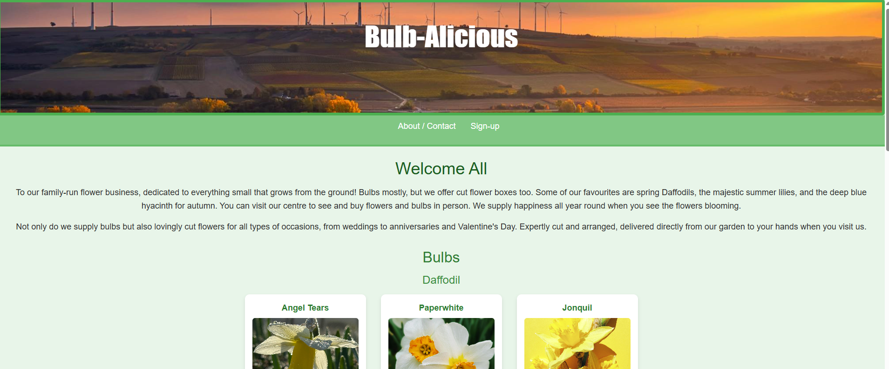
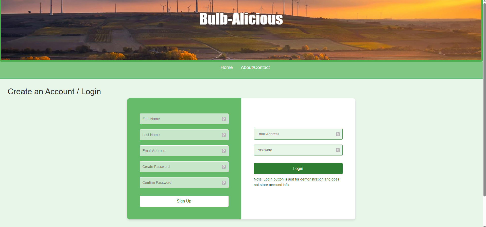
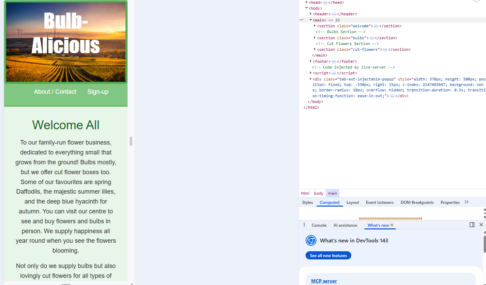
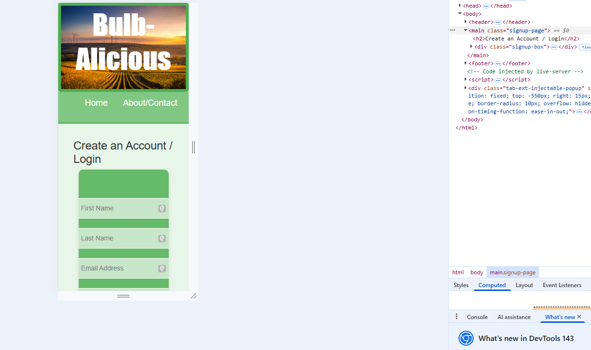
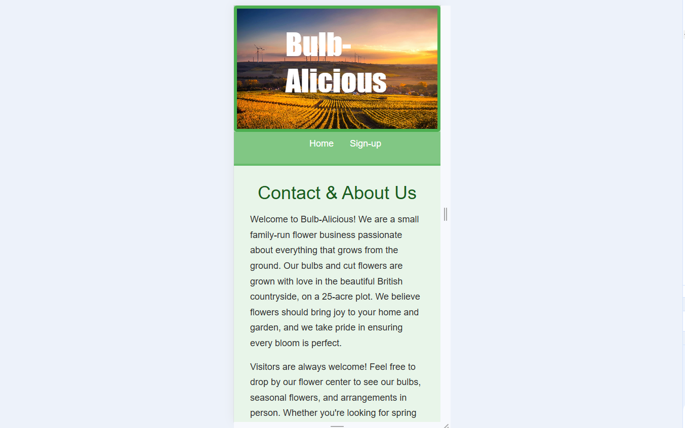

# Bulb-Alicious Project

## Project Overview

Bulb-Alicious is a front-end website designed for individuals who have a passion for gardening, particularly those interested in growing flowers at home. The site is aimed at gardening enthusiasts, beginners with limited experience, and DIY gardeners who enjoy growing their own plants.

The website is suitable for users of all technical skill levels and has been designed with simplicity and clarity in mind. It also appeals to eco-conscious users who are interested in sustainable gardening practices and supporting environmentally-minded businesses.

 **Bulb-Alicious live site:** (https://luke-smith92.github.io/Bulb-Alcious-milestone-project1/)

---

## Project Goals

- Create a clear and easy-to-navigate gardening website  
- Showcase bulbs and seasonal flowers in an accessible format  
- Ensure responsiveness across desktop, tablet, and mobile devices  
- Apply consistent styling across all pages  

---

## User-Centred Design

### User Stories

The following user stories were used to guide layout, navigation, and content decisions throughout the project.

#### First Time Visitor Goals
- As a first-time visitor, I want to quickly understand the purpose of the website.
- As a first-time visitor, I want to navigate the site easily to find information about bulbs and seasonal flowers.
- As a first-time visitor, I want to see visual content that reassures me the site is clear and easy to use.

#### Returning Visitor Goals
- As a returning visitor, I want to revisit specific sections such as bulbs or seasonal flowers without difficulty.
- As a returning visitor, I want to find the contact or sign-up page quickly.
- As a returning visitor, I want to access external or social links for further information.

#### Frequent User Goals
- As a frequent user, I want to check for new flower varieties or seasonal updates.
- As a frequent user, I want reassurance that my data is handled responsibly when using forms.

---

## Key Features

- Simple and clear navigation
- Dedicated pages for:
  - Bulbs
  - Seasonal Flowers
  - Sign-Up
  - About / Contact
  - Account
- Informational blurbs describing different flower and bulb types
- Separate seasonal flowers section for inspiration
- Responsive layout tested on mobile and tablet devices

---

## Design & Usability

The website layout was designed with simplicity in mind. Navigation is consistent across all pages, allowing users to move easily between sections. A clear visual hierarchy improves readability and usability, particularly for less experienced users.

Imagery is used throughout the site to reinforce the gardening theme while keeping the overall design clean and uncluttered.

---

## Testing

### Manual Testing

Most testing was carried out manually in Visual Studio Code. The following areas were tested:
- Page layout and structure
- Image display and alignment
- Responsiveness across different screen sizes

### Desktop Views

**Index Page**  

**Sign-Up Page**  

**About / Contact Page**  

---

### Mobile Views

**Index Page (Mobile)**  

**Sign-Up Page (Mobile)**  

**About / Contact Page (Mobile)**  

---

## Bugs and Fixes

- **Sign-Up Page Layout:** Table layout caused excessive spacing between sign-up and login sections. Fixed by resolving conflicting CSS styles.
- **Cart Functionality:** A basket feature was attempted but removed to maintain page styling consistency.
- **Image Alignment:** Issues with inline image and text alignment were resolved by revising CSS layout methods.
- **Social Media Links:** Syntax errors initially prevented links from working. Fixed by correcting anchor tags and class usage.

---

## Deployment Challenges

Deploying the website required careful attention to responsive design and consistent styling across pages. Early issues included CSS conflicts and image alignment problems, which were resolved by refactoring stylesheets and linking CSS files consistently across all pages.

Testing on mobile and tablet devices ensured content scaled correctly and navigation remained intuitive.

---

## User Feedback

The website was reviewed by friends and family members to assess usability and clarity. Feedback highlighted:
- Intuitive navigation
- Visually appealing imagery
- Clear and readable text

Suggestions included adding more detailed growing information, which has been noted for future development.

---

## Future Improvements

- Add detailed growing guides for each bulb or flower
- Highlight beginner-friendly and advanced plant varieties
- Develop full e-commerce functionality for purchasing products online

---

## Credits & Resources

### Learning Resources
- GreatStack YouTube tutorials – assisted with sign-up page development  
- Code Institute resources and Slack community  
- W3Schools documentation  

### Media
All images were sourced from **Pexels**:
- pexels-larissafarber-28930893  
- pexels-jennifer-r-1259086-31182645  
- pexels-cathy-b-748462208-31116905  
- pexels-gutjahr-aleksandr-3045334-11329235  
- pexels-chiaroscuro-154214185-11848180  
- pexels-cody-157460211-10737505  
- pexels-didi-lecatompessy-2149441489-30824121  
- pexels-eva-bronzini-5501282  
- pexels-matu-bil-96606-348287  
- pexels-pixabay-325944  
- pexels-tim-dusenberry-2385423-13012158  
- pexels-unaizat97-10051509  

---

## Reflection

This project strengthened my understanding of responsive design, CSS organisation, and user-centred layout planning. Through testing and iteration, I improved consistency across pages and resolved layout and styling issues. The project also highlighted the importance of planning content structure before development begins.
