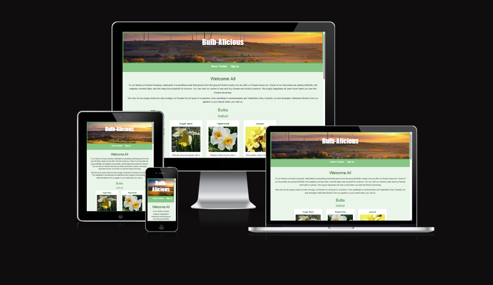

# Bulb-Alicious Project

## Project Overview

Bulb-Alicious is a front-end website designed for individuals who have a passion for gardening, particularly those interested in growing flowers at home. The site is aimed at gardening enthusiasts, beginners with limited experience, and DIY gardeners who enjoy growing their own plants.

The website is suitable for users of all technical skill levels and has been designed with simplicity and clarity in mind. It also appeals to eco-conscious users who are interested in sustainable gardening practices and supporting environmentally-minded businesses.

🔗 **Live Site:** *(add your GitHub Pages link here)*

---

## Project Goals

- Create a clear and easy-to-navigate gardening website  
- Showcase bulbs and seasonal flowers in an accessible format  
- Ensure responsiveness across desktop, tablet, and mobile devices  
- Apply consistent styling across all pages  

---

## User-Centred Design

### User Stories

#### First Time Visitor Goals
- Quickly understand the purpose of the website  
- Navigate the site easily to find information about bulbs and seasonal flowers  
- See visual content that reassures clarity and usability  

#### Returning Visitor Goals
- Revisit specific sections such as bulbs or seasonal flowers  
- Find the contact or sign-up page quickly  
- Access external or social links for further information  

#### Frequent User Goals
- Check for new flower varieties or seasonal updates  
- Ensure personal data is handled responsibly  

---

## Key Features

- Simple and clear navigation  
- Dedicated pages: Bulbs, Seasonal Flowers, Sign-Up, About / Contact, Account  
- Informational blurbs describing different flower and bulb types  
- Separate seasonal flowers section for inspiration  
- Responsive layout tested on mobile and tablet devices  

---

## Testing

### Manual Testing

Most testing was carried out manually in Visual Studio Code:
- Page layout and structure  
- Image display and alignment  
- Responsiveness across different screen sizes  

### Desktop Views

**Index Page**  

**Sign-Up Page**  

**About / Contact Page**  

### Mobile Views

**Index Page (Mobile)**  

**Sign-Up Page (Mobile)**  

**About / Contact Page (Mobile)**  

---

## Performance Testing

Google PageSpeed Insights was used to assess performance and accessibility.

**Before Optimisation**

**Mobile:**  

**Desktop:**  

**After Converting Images to WebP & Resizing**

**Mobile:**  

**Desktop:**  

Performance scores improved significantly:
- Mobile: 62% → 73%  
- Desktop: 62% → 93%

The improvement is primarily due to converting images to the WebP format and resizing them to better fit the website layout, reducing page load times.

---

## Code Validation

The website’s HTML and CSS were validated using online tools to ensure best practices and standards compliance.

**HTML Validation:**  

**CSS Validation:**  

Validation confirmed that the website’s code follows current web standards and best practices, improving reliability and cross-browser compatibility.

---

## Bugs and Fixes

- **Sign-Up Page Layout:** Resolved spacing issues by fixing CSS conflicts    
- **Image Alignment:** Corrected inline display issues  
- **Social Media Links:** Fixed broken anchor tags and classes  

---

## Deployment Challenges

Deploying the website required attention to mobile responsiveness and consistent styling. Initial CSS conflicts and image alignment issues were resolved by restructuring CSS and linking stylesheets consistently.

---

## User Feedback

Tested with friends and family:
- Navigation found to be intuitive  
- Images visually appealing  
- Text easy to read  

Suggestions to add more detailed growing guides noted for future improvements.

---

## Future Improvements

- Add detailed growing guides for each bulb or flower  
- Highlight beginner-friendly and advanced plant varieties  
- Develop full e-commerce functionality for purchasing products online  

---

## Credits & Resources

### Learning Resources
- GreatStack YouTube tutorials – helped with sign-up page  
- Code Institute resources and Slack community  
- W3Schools documentation  

### Media
All images sourced from **Pexels**:
- pexels-larissafarber-28930893  
- pexels-jennifer-r-1259086-31182645  
- pexels-cathy-b-748462208-31116905  
- pexels-gutjahr-aleksandr-3045334-11329235  
- pexels-chiaroscuro-154214185-11848180  
- pexels-cody-157460211-10737505  
- pexels-didi-lecatompessy-2149441489-30824121  
- pexels-eva-bronzini-5501282  
- pexels-matu-bil-96606-348287  
- pexels-pixabay-325944  
- pexels-tim-dusenberry-2385423-13012158  
- pexels-unaizat97-10051509  

---

## Reflection

This project strengthened my understanding of responsive design, CSS organisation, and user-centred layout planning. Testing and iteration improved consistency and resolved layout/styling issues, highlighting the importance of planning content structure before development.

